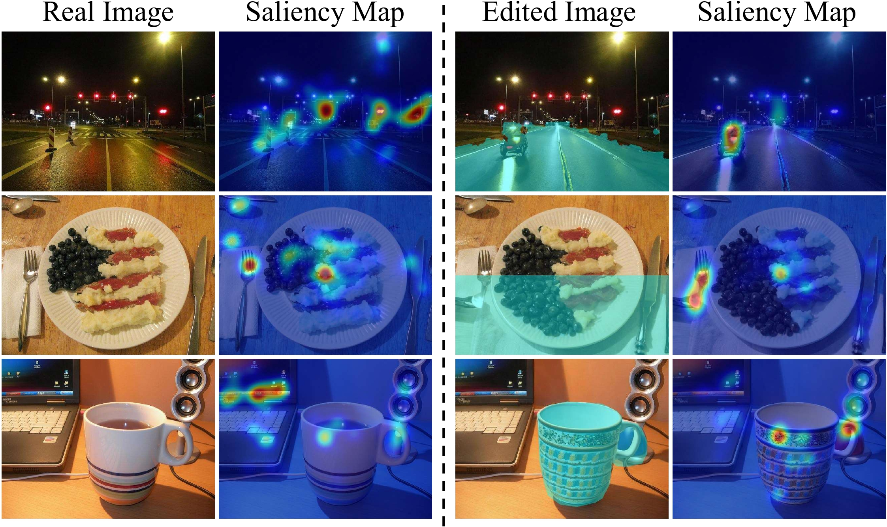

# Unveiling the Truth (IEEE Signal Processing Letters 2024)
### Exploring Human Gaze Patterns in Fake Images 
[**Giuseppe Cartella**](https://scholar.google.com/citations?hl=en&user=0sJ4VCcAAAAJ),
[**Vittorio Cuculo**](https://scholar.google.it/citations?user=usEfqxoAAAAJ&hl=it),
[**Marcella Cornia**](https://scholar.google.com/citations?hl=en&user=DzgmSJEAAAAJ),
[**Rita Cucchiara**](https://scholar.google.com/citations?hl=en&user=OM3sZEoAAAAJ)

This is the **official repository** for the paper "*Unveiling the Truth: Exploring Human Gaze Patterns in Fake Images*".

## 📣 Latest News 📣
- **`30 April 2024`** [Dataset]() has been released!

## Overview

<p align="center">
    
</p>

## Download the dataset
Dataset download is available [here]().

The dataset should be structured as follows:
```
|-dataset/
    |-images/
        |-original/
            |- <img_id_1>.jpg
            |- ...
        |-pix2pix_magicbrush/
            |- <img_id_1>.jpg
            |- ...
        |-semantic_agnostic/
            |- <img_id_1>.jpg
            |- ...
        |-semantic_aware/
            |- <img_id_1>.jpg
            |- ...
    |-masks/
        |-semantic_agnostic/
            |- <img_id_1>.png
            |- ..
        |-semantic_aware/
            |- <img_id_1>.png
            |- ...

    |-gaze_data.pickle
    |-ip2p_edit_instruction_ADE_subset.json
    |-ip2p_edit_instruction_COCO_subset.json
    |-ip2p_edit_instruction_LHQ_subset.json
    |-semantic_aware_prompt_ADE_subset.json
    |-semantic_aware_prompt_COCO_subset.json
    |-semantic_aware_prompt_LHQ_subset.json
    |-readme.txt
```

Please refer to the **readme.txt** file for all details.

## How to Visualize Scanpaths
As a first step, move the dataset into the project directory.

To visualize a scanpath run the following command:

```sh
python visualize_scanpath.py --img_id COCO_000000229478 --user=4 --type=semantic_aware
```

By default, two output files are generated:
- output_raw.png --> It contains raw fixations (both saccades and fixations)
- output_fixations.png --> It contains only the final processed fixations.

Red and blue circles represent the first and latest fixation of the plotted scanpath, respectively.

## TODO
- [x] Dataset release